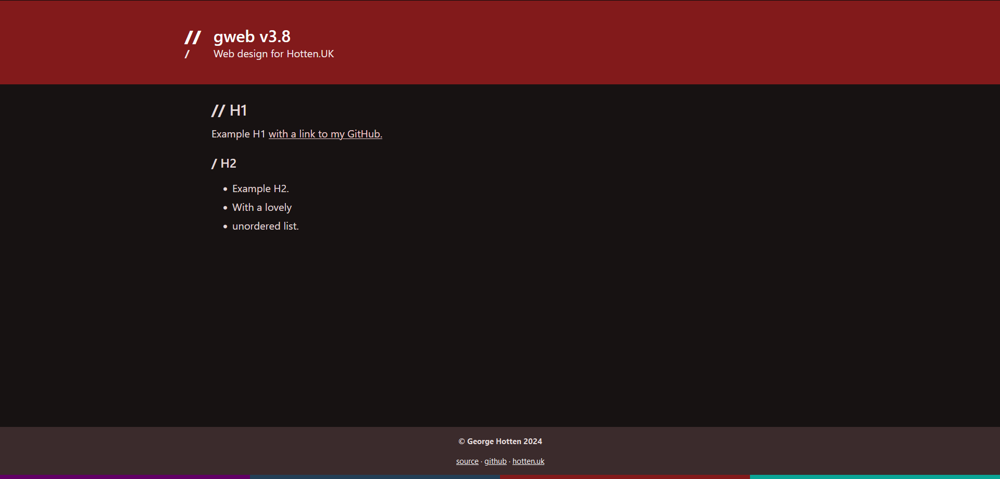
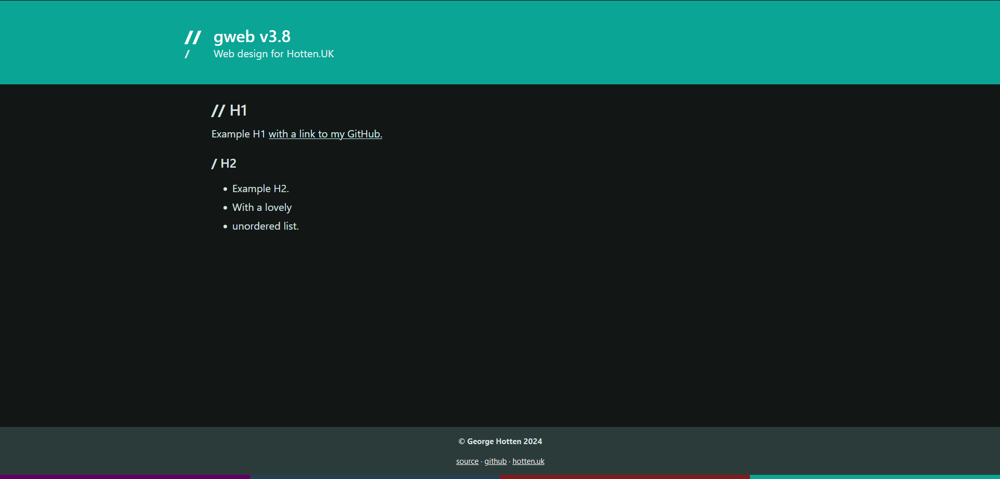
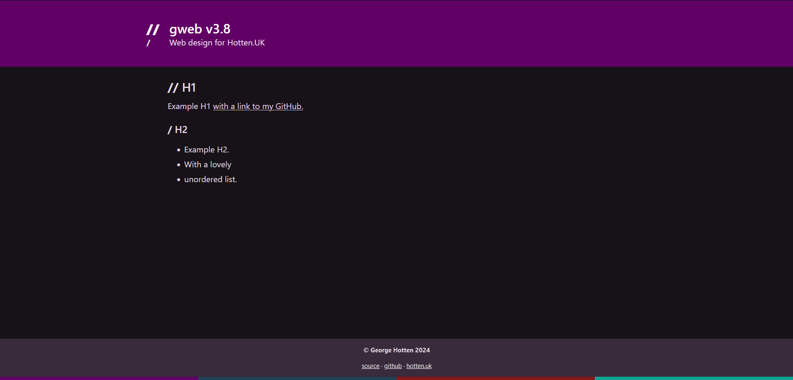

# gweb v3.10
my website aesthetic

gweb is a package that sites install, so styling updates reach every site through a version bump instead of copying files by hand. This repo is also a demo site (`npm run dev`) for previewing changes.





## What's in the package

| Export | What it is |
| --- | --- |
| `@gxorge/gweb/styles` | Global styles: Bulma plus the gweb layout, headings, links, footer and dark mode |
| `HeroTitle` | Page header. Props: `title`, `subtitle`, `colour`, `text_colour` |
| `BackBreadcrum` | "< home" / "< back" link. Props: `sections`, `linkClass` |
| `Footer` | Footer with the colour strip. Prop: `copyright`; links go in the slot |

Everything lives in `src/lib`. Anything outside it (routes, `app.html`, configs) is only for the demo site and isn't shipped.

## Using it in a site

Install it from a tagged release:

```json
"dependencies": {
	"@gxorge/gweb": "github:gxorge/gweb3#v3.10.0"
}
```

npm runs the `prepare` script on install, which builds the package into `dist/`. The site needs `sass` in its devDependencies.

Choose the theme colour in a stylesheet in the site, e.g. `src/theme.scss`:

```scss
@use "@gxorge/gweb/styles" with ($theme: #821a1b);
```

Then import that file once and use the components in `src/routes/+layout.svelte`:

```svelte
<script>
    import '../theme.scss';
    import { Footer } from '@gxorge/gweb';
</script>

<main class="gweb-container">
    <slot />
</main>

<Footer copyright="© 2026 George Hotten">
    <a href="https://github.com/gxorge/">github</a> &middot;
    <a href="https://hottentechnology.com">hottentechnology.com</a>
</Footer>
```

Import the global styles only in the layout, never inside a component. A second import would compile another copy of Bulma with the default theme.

Pages use the components the same way:

```svelte
<script>
    import { HeroTitle, BackBreadcrum } from '@gxorge/gweb';
</script>

<HeroTitle title="Projects"/>
<BackBreadcrum sections={["/projects", "/fire"]} linkClass="gweb-link-black"/>
```

`app.html` stays in each site. Keep `<body class="gweb-site">` and set your own `theme-color` meta tag.

## Releasing an update

1. Make the change and check it with `npm run dev`.
2. Bump `version` in `package.json`, commit, then tag it: `git tag v3.11.0 && git push --tags`.
3. In each site, change the tag in its dependency and run `npm install`.

To try unreleased changes in a real site, run `npm link` here and then `npm link @gxorge/gweb` in the site.
